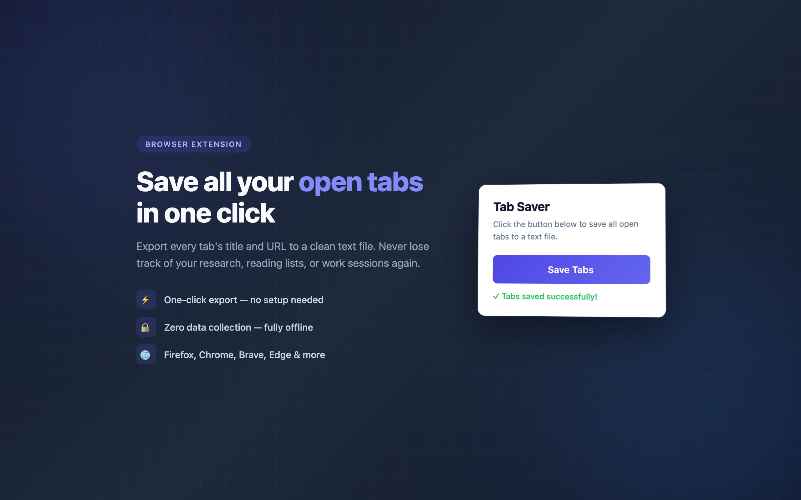
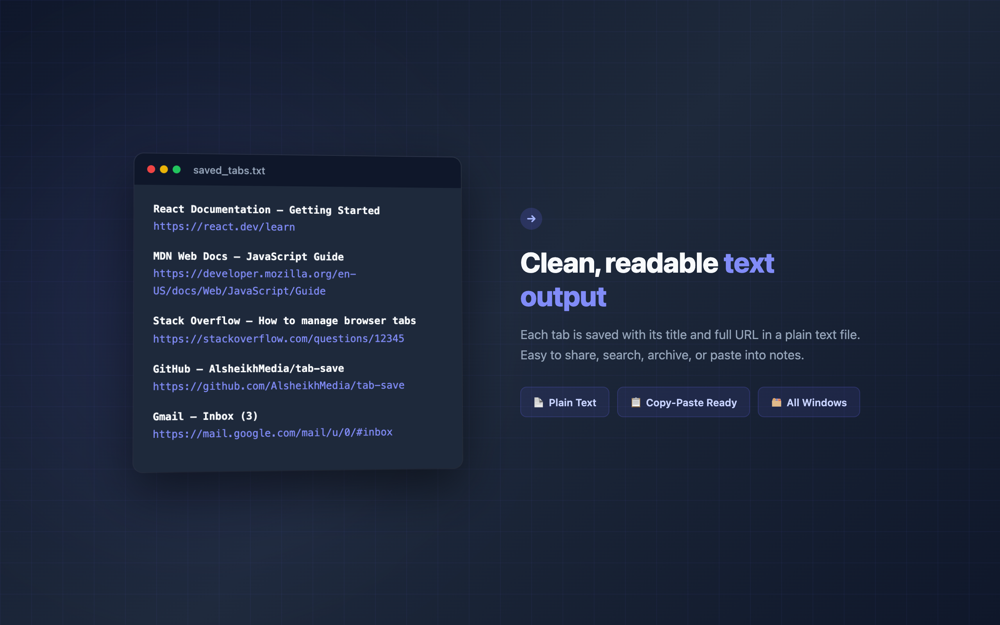

# Tab Saver

Save all your open browser tabs to a text file in one click. No accounts, no data collection, fully offline.



## What It Does

Click the icon, get a `.txt` file with every open tab's title and URL. That's it.

- **One click** — no popups on Firefox, one button on Chromium
- **Fully offline** — zero network requests, zero tracking
- **Lightweight** — under 5 KB, no background processes
- **Open source** — MIT licensed



## Install

| Browser | Link |
|---------|------|
| Firefox | [Firefox Add-ons (AMO)](https://addons.mozilla.org/en-US/firefox/addon/tab-saver/) |
| Chrome / Brave / Edge | Manual install (see below) |

### Manual Install

**Firefox:**
1. Go to `about:debugging` → "This Firefox" → "Load Temporary Add-on"
2. Select `FireFox/manifest.json`

**Chrome / Brave / Edge:**
1. Go to `chrome://extensions` (or `brave://extensions`, `edge://extensions`)
2. Enable **Developer Mode**
3. Click **Load unpacked** → select the `Brave/tab_save/` folder

## Output Format

```
React Documentation — Getting Started
https://react.dev/learn

MDN Web Docs — JavaScript Guide
https://developer.mozilla.org/en-US/docs/Web/JavaScript/Guide

Stack Overflow — How to manage browser tabs
https://stackoverflow.com/questions/12345
```

Plain text. Easy to share, search, archive, or paste into notes.

## Architecture

Two separate implementations for different browser engines:

| | Firefox | Chromium (Chrome/Brave/Edge) |
|---|---|---|
| Manifest | V2 | V3 |
| Trigger | Toolbar icon click | Button in popup |
| Download | `browser.downloads` API | Anchor element click |
| API | `browser.*` (Promise-based) | `chrome.*` (callback-based) |
| Permissions | `tabs`, `downloads` | `tabs` |

## Privacy

Tab Saver reads tab titles and URLs only when you click the icon. It makes no network requests, stores no data, and has no analytics. Everything stays on your device.

## License

MIT

---

Built by [AlsheikhMedia](https://github.com/AlsheikhMedia)
